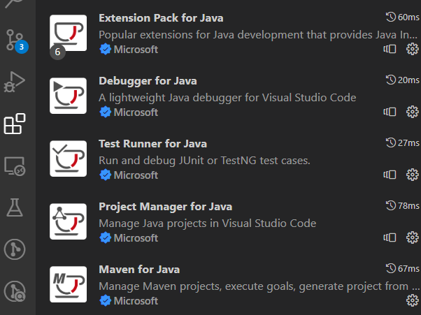
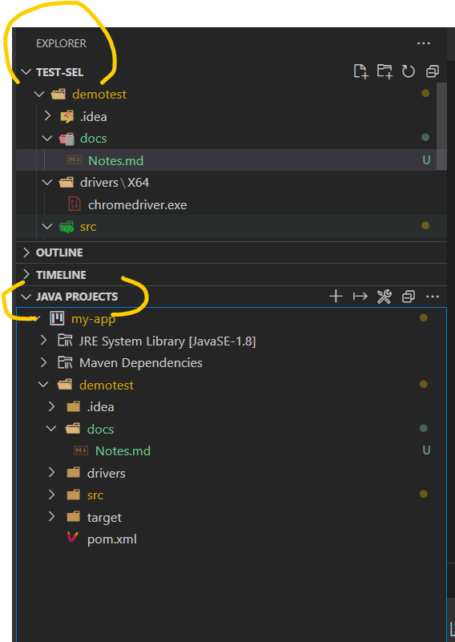
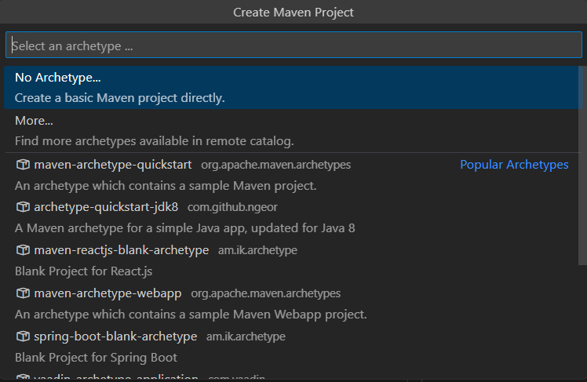

## Visual Studio Setup for Java and Selenium Testing

**1)** Ensure that the follwoing Java extensions are installed:
  - Extension Pack for Java
  - Debugger for Java
  - Test Runner for Java
  - Maven for Java
  - Project Manager for Java
  - 


With these extensions installed, you would have the `JAVA PROJECTS` window appear in your VS Code Explorer window:




Also, in addition to the `Java Projects`, there would also be added a `Create Maven Project` context menu to your Explorer window, when you right-click.

**2)** After the installation of these extensions, reload VS Code. Once restarted, open the Explorer window, then right-click to show the `Create Maven Project` and click on it. This would open the Command Pallete with Maven project options:


  - Scroll the list and select the option `maven-archetype-quickstart`
  - Fill in the presented options like GroupdId and ArchitypeId
  - Select the Snapshot version (recommended that you select the most recent stable snapshot, except you have a reason to do otherwise.)
  - Some options wuld eventually be moved to the command line for you to complete. You can just press `enter` for the rest of this process.

**3)** Ensure that the `pom.xml` has the required dependecies for `JUnit 5` and `Selenium`. It should look something like the below:
```xml
  <dependencies>
    
    <!-- https://mvnrepository.com/artifact/org.junit.jupiter/junit-jupiter-api -->
    <dependency>
      <groupId>org.junit.jupiter</groupId>
      <artifactId>junit-jupiter-api</artifactId>
      <version>5.10.0</version>
      <scope>test</scope>
    </dependency>
    <dependency>
      <groupId>org.junit.jupiter</groupId>
      <artifactId>junit-jupiter-engine</artifactId>
      <version>5.10.0</version>
      <scope>test</scope>
    </dependency>
    <!-- https://mvnrepository.com/artifact/org.seleniumhq.selenium/selenium-java -->
    <dependency>
      <groupId>org.seleniumhq.selenium</groupId>
      <artifactId>selenium-java</artifactId>
      <version>4.16.1</version>
    </dependency>

  </dependencies>
```